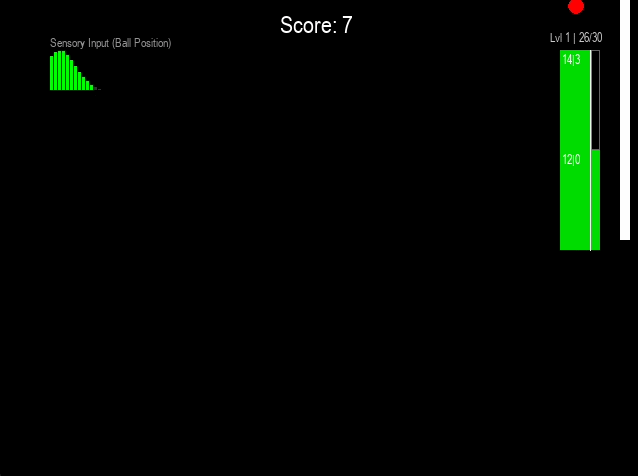

# SNN-Pong-RSTDP

A spiking neural network learns to play Pong — without backpropagation, without gradients.

Built with [Brian2](https://brian2.readthedocs.io/), the network uses biologically-inspired conductance-based LIF (leaky integrate-and-fire) neurons, and learns purely through **reward-modulated STDP (R-STDP)**: dopamine-gated eligibility traces are the only learning signal driving synaptic change.

> 🚧 **Status: Work in Progress.** This is an ongoing experiment, not a polished library. The network currently learns *most of the time* — performance varies between runs and isn't yet consistently stable. See [Known Issues & Roadmap](#known-issues--roadmap) below.

<p align="center">
  
  <br>
  <em>Caption: the network mid-training, tracking the ball via a windowed spike-count readout on the motor layer.</em>
</p>

---

## Why this project?

Most RL-for-Atari demos use deep networks trained with backprop. This project asks a different question: **can a biologically plausible spiking network, learning only through local dopamine-gated synaptic eligibility traces, solve a simple control task like Pong?** No gradient descent, no global error signal — just conductance-based LIF neurons, STDP, and a scalar reward.

It's as much a neuroscience-inspired learning experiment as it is a Pong bot.

## How it works

- **Sensory layer** (100 excitatory neurons): ball's y-position encoded as a Gaussian bump of Poisson firing rates.
- **Motor layer** (100 excitatory + 25 inhibitory neurons): drives paddle movement. Read out via a windowed, chunk-histogram winner-take-all with hysteresis (the paddle only switches target chunk if the new one has ≥1.25× the spike count of the current one, damping jitter).
- **R-STDP**: an eligibility trace `c` (built from local STDP) is multiplied by a dopamine signal `D` (driven by reward) to update weights every 10ms — implemented as an explicit `network_operation`, not Brian2's native on_pre/on_post weight updates.
- **iSTDP**: local inhibitory plasticity in the output layer, keeping excitation/inhibition balanced — separate homeostatic mechanism from the reward-driven learning.
- **Adaptive thresholds**: per-neuron spiking threshold creeps up with activity and decays back to baseline — a second homeostatic mechanism.
- **Episodic normalization**: after every missed ball, incoming synaptic weight sums per neuron are pulled softly back toward a target value.
- **Curriculum learning**: the game's y-axis is split into bins (`num_chunks`) that get progressively finer as the agent clears a 75% hit-rate threshold per chunk — motor precision is demanded incrementally, not from the start.
- **Reward shaping**: a ball hit gives +1; moving the paddle toward the ball's current chunk gives +0.075, scaled by a dynamic per-chunk multiplier that boosts reward for underperforming chunks (a simple automatic form of attention/curriculum).

## Project structure

| File | Purpose |
|---|---|
| `main.py` | Entry point — runs the game + training loop |
| `brain.py` | `Brain_rstdp`: builds the Brian2 network and owns the game loop via `network_operation` callbacks. Nearly all of the interesting logic lives here. |
| `game.py` | `PongGame`: single-paddle Pong (no player 2 — ball bounces off the right-wall paddle only; a miss triggers an episode reset) |
| `telemitry.py` *(sic)* | `BrainTelemetry`: chunked, LZF-compressed HDF5 logger |
| `analysis.py` | Post-run plots: cellular traces, synaptic weight heatmaps, tracking-error/dopamine trends, spike raster |

## Getting started

### Requirements

- Python 3.10+
- Dependencies: `brian2`, `numpy`, `pygame-ce`, `h5py`, `matplotlib`

```bash
pip install -r requirements.txt
```

### Run

```bash
python main.py
```

- Opens a live Pygame window, running for up to 6000 simulated seconds (`Ctrl+C` to stop early).
- Press **`T`** in-game to toggle turbo mode (headless, runs at max speed) vs. visual mode.
- On exit, telemetry is dumped to `brain_telemetry.h5` and analysis plots open automatically.

## Known Issues & Roadmap

This project is under active, informal development. Known rough edges:

- **Inconsistent convergence** — the network usually learns to track and hit the ball, but training stability varies noticeably between runs.
- No automated tests, no CI.
- No hyperparameter search — most constants are still hand-tuned.

Planned / considered next steps:
- [ ] Stabilize convergence, investigate run-to-run variance
- [ ] Add basic sanity-check tests (network builds, one episode runs without crashing)
- [ ] Hyperparameter sweep for reward shaping / eligibility trace decay

## Contributing / Feedback

This is a personal research project shared to document progress — feedback, questions, and issues are welcome, but expect an evolving codebase rather than a stable API.

## License

[MIT](LICENSE)
